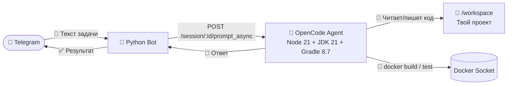

# 🚀 Telecode — Remote OpenCode Workplace via Telegram

[](https://github.com/trollimo/telecode/actions/workflows/ci.yml)
[](https://www.python.org/)
[](https://docs.docker.com/compose/)
[](https://opencode.ai)

> **Пиши код с телефона.** Отправь задачу в Telegram → OpenCode делает её в Docker-контейнере → ответ возвращается в Telegram.

---

## ✨ Зачем это?

| 💡 | Идея |
|---|---|
| **📱 Remote Vibe Coding** | Кодируй из любого места — с телефона, планшета, чужого компа. Не нужен IDE, не нужен SSH. Просто Telegram. |
| **🎯 Агент работает только в твоей папке** | Весь проект монтируется в контейнер через volume. Агент OpenCode физически не может выйти за пределы `/workspace`. Никакого rogue-агента, который перепишет систему. |
| **🔒 Безопасно** | Telegram-бот фильтрует по `allowed_user_id` — никто кроме тебя не отправит задачу. Токены и API-ключи лежат в `~/.rem-opencode/` вне репозитория. |
| **🐳 Docker Socket — sidecar контейнеры** | OpenCode может запускать соседние контейнеры через `/var/run/docker.sock`. Хочешь протестировать сборку? `docker build` внутри контейнера — легко. |
| **🧠 Свои скиллы и агенты** | Подкладываешь свои `AGENTS.md` и `SKILLS/` — OpenCode использует их как инструкции для кодирования. Java-стиль, Python-стиль, TDD, code review — настраивается под тебя. |
| **⚡ Не блокирует текущую задачу** | Сообщения уходят через `prompt_async` (неблокирующий). Можно отправить новый запрос, даже если агент занят — он закончит текущее и возьмётся за следующее. |
| **💬 Multi-turn диалоги** | Бот запоминает контекст. Уточняй, переспрашивай, правь — как с живым разработчиком. |

---

## 🔄 Схема работы



*Если GitHub не отображает Mermaid:*

```
Telegram  →  Python Bot  →  OpenCode Agent  →  /workspace (твой код)
    ↑                            │
    └────── Ответ в Telegram ────┘
```

---

## 📋 Требования

- **Docker Engine** 24+ и **Docker Compose** v2
- **Git Bash** (Windows) или **bash** (Linux/macOS)
- Telegram Bot Token (от [@BotFather](https://t.me/botfather))
- Ваш Telegram User ID

---

## 🚀 Быстрый старт

### 1. Получить токен Telegram бота

1. Откройте Telegram и найдите [@BotFather](https://t.me/botfather)
2. Отправьте `/newbot` и следуйте инструкциям
3. Скопируйте полученный токен (формат: `738456...:AAH...`)

### 2. Узнать свой Telegram User ID

Напишите [@userinfobot](https://t.me/userinfobot) — он ответит вашим числовым ID.

### 3. Настроить конфигурацию

```bash
mkdir -p ~/.rem-opencode
```

Создайте `~/.rem-opencode/config.json`:
```json
{
  "telegram_token": "738456...:AAH...",
  "allowed_user_id": 123456789,
  "opencode_url": "http://opencode:4096"
}
```

> ⚠️ **Весь каталог `~/.rem-opencode/` содержит секреты и не коммитится.**

### 4. Настроить проект для OpenCode

OpenCode работает **только в той папке, которая смонтирована в контейнер**. По умолчанию это `d:/git/opc-agents-pipeline:/workspace` в `docker/compose.yml`.

```yaml
# docker/compose.yml
volumes:
  - d:/git/my-project:/workspace   # ← укажи свой путь
```

**Зона влияния агента — только `/workspace`.** Он не имеет доступа к хосту, кроме:
- ✅ Твоей рабочей папки (`/workspace`)
- ✅ Docker socket (опционально, для сборки контейнеров)
- ❌ Всё остальное — недоступно

### 5. (Опционально) Свои скиллы и агенты

| Файл | Назначение | Где лежит |
|---|---|---|
| `AGENTS.md` | Глобальные инструкции для OpenCode (стиль кода, правила) | `docker/opencode/AGENTS.md` |
| `SKILLS/*/` | Наборы скиллов (Java Senior, Python Tester, …) | `docker/opencode/SKILLS/` |
| `opencode.json` | Модели провайдеров (DeepSeek, Anthropic, …) | `~/.rem-opencode/opencode.json` |

**Минимальный конфиг** — без токенов, использует встроенные бесплатные модели OpenCode из `models.dev` (DeepSeek V4 Flash Free, Big Pickle и др.):
```json
{
  "$schema": "https://opencode.ai/config.json"
}
```

**Если хочешь свои модели** (OpenAI, Anthropic, OpenCode Zen с API-ключом):
```json
{
  "$schema": "https://opencode.ai/config.json",
  "provider": {
    "anthropic": {
      "options": { "apiKey": "{env:ANTHROPIC_API_KEY}" }
    },
    "openai": {
      "options": { "apiKey": "{env:OPENAI_API_KEY}" }
    }
  }
}
```

> 💡 При первом запуске `./scripts/run.sh` создаст шаблоны `config.json` и `opencode.json` автоматически.

### 6. Запустить стек

```bash
# Первый запуск (сборка образов)
./scripts/run.sh

# Или без пересборки (если образы уже есть)
docker compose -f docker/compose.yml --project-directory . up -d
```

### 7. Написать боту

Найдите своего бота в Telegram и отправьте любое текстовое сообщение. Бот передаст задачу в OpenCode и вернёт ответ.

```
Вы:   "Сделай миграцию БД для users"
Бот:  ⏳ Отправляю задачу в OpenCode...
Бот:  ✅ Готово! Создал migration.py, обновил schema.sql
```

---

## 📖 Команды

| Команда | Описание |
|---|---|
| `./scripts/run.sh` | Первый запуск — создаёт конфиги, собирает образы, стартует |
| `./scripts/stop.sh` | Остановить все контейнеры |
| `./scripts/restart.sh` | Перезапустить все сервисы |
| `./scripts/restart.sh bot` | Перезапустить только Telegram бота |
| `docker compose -f docker/compose.yml --project-directory . logs -f bot` | Логи бота |
| `docker compose -f docker/compose.yml --project-directory . logs -f opencode` | Логи OpenCode |

---

## 🛠 Как избежать регулярной пересборки

Образы собираются **только** при первом запуске или явном указании `--build`.

- ✅ `./scripts/restart.sh` — **без пересборки**
- ✅ `docker compose restart` — **без пересборки**
- ✅ `docker compose up -d` — **без пересборки**
- ❌ `docker compose up -d --build` — принудительная пересборка
- ❌ `docker compose build` — ручная пересборка

Код бота подключен как Docker volume (`./bot:/app/bot`), поэтому изменения в Python-файлах применяются после перезапуска контейнера без пересборки образа.

```bash
# Пример: изменили код → перезапустили бота
./scripts/restart.sh bot
```

---

## 🧪 Разработка

### Зависимости

```bash
pip install -r requirements.txt
```

### Тесты

```bash
pytest bot/tests/ -v
```

### Структура проекта

```
.
├── .github/workflows/        # GitHub Actions CI
├── bot/                      # Telegram bot
│   ├── main.py               # Entrypoint
│   ├── config.py             # Загрузка конфига
│   ├── handlers.py           # Обработчики Telegram
│   ├── opencode_client.py    # HTTP-клиент для OpenCode API
│   └── tests/                # Тесты pytest
├── docker/                   # Docker-инфраструктура
│   ├── compose.yml           # Docker Compose
│   ├── opencode/             # OpenCode контейнер
│   │   ├── Dockerfile
│   │   ├── AGENTS.md         # Глобальный агент для OpenCode
│   │   └── SKILLS/           # Скиллы для OpenCode
│   └── bot/
│       └── Dockerfile.bot
├── docs/                     # Документация
│   ├── ARCHITECTURE.md
│   ├── DEVELOPMENT.md
│   ├── DEPLOYMENT.md
│   └── API.md
├── scripts/                  # Скрипты управления
│   ├── run.sh
│   ├── stop.sh
│   ├── restart.sh
│   └── restart.ps1
├── tests/manual/             # Ручные/отладочные тесты
├── AGENTS.md                 # Инструкции для AI-сессий
├── project-goal.md           # Цель проекта
└── requirements.txt
```

---

## 🔒 Безопасность

- Токен Telegram и User ID хранятся в `~/.rem-opencode/config.json`
- OpenCode config (`opencode.json`) там же — `~/.rem-opencode/`
- Все файлы в `~/.rem-opencode/` **никогда не коммитятся**
- Бот отвечает только одному пользователю (фильтр по `allowed_user_id`)
- API-ключи LLM передаются через переменные окружения (`.env`)
- Агент OpenCode работает только внутри `/workspace` — доступ к хосту ограничен

---

## 📚 Документация

- [Архитектура](docs/ARCHITECTURE.md)
- [Разработка](docs/DEVELOPMENT.md)
- [Деплой](docs/DEPLOYMENT.md)
- [API Reference](docs/API.md)
