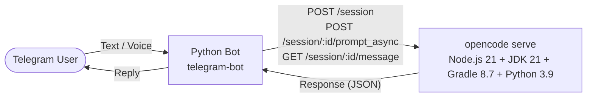

# Architecture



## Components

### Telegram Bot (`bot/`)

- Python 3.11+ with `python-telegram-bot` framework
- Filters messages by `allowed_user_id` from config
- Talks to `opencode serve` HTTP API (port 4096)
- **Async flow** (non-blocking):
  1. `POST /session` — create a new session
  2. `POST /session/:id/prompt_async` — send prompt (returns 204 immediately)
  3. `GET /session/:id/message` — poll for assistant response
- Same flow is used for both new sessions and follow-ups, so sending a message never blocks even if the session is busy with a running tool.
- If a saved session no longer exists (404), the client automatically creates a new session and retries.
- Truncates long responses to Telegram's 4096-char limit.

### OpenCode Container (`docker/opencode/Dockerfile`)

- Base: `ubuntu:22.04`
- Contains: **Node.js 21**, **JDK 21 (Temurin)**, **Gradle 8.7**, **Python 3.9**, **opencode CLI** (npm)
- Runs `opencode serve` (headless HTTP API) on port **4096**
- Default `opencode.json` with DeepSeek V4 Flash Free model
- Config overridable via volume mount
- `docker/opencode/AGENTS.md` injected as global agent instructions
- `docker/opencode/SKILLS/` injected as available skills

### Orchestration (`docker/compose.yml`)

- Two services on a shared bridge network (`opencode-net`)
- OpenCode container exposes port 4096
- Gradle cache persisted in a Docker volume (avoids re-downloading)
- LLM API keys via environment variables
- Bot container mounts host config file read-only (`~/.rem-opencode/config.json`)
- Bot waits for OpenCode healthcheck before starting
- Bot code is volume-mounted for hot-reload during development

## Data Flow

1. User sends text to Telegram bot
2. Bot validates `allowed_user_id`
3. If no active session: `POST /session` → creates new session
4. Bot sends prompt: `POST /session/:id/prompt_async` with the user's text
5. Bot polls `GET /session/:id/message` until assistant response appears
6. Response flows back through bot → Telegram

## Directory Structure

```
.
├── .github/workflows/       # GitHub Actions CI
├── bot/                     # Telegram bot source
│   ├── main.py              # Entrypoint
│   ├── config.py            # Config loader
│   ├── handlers.py          # Telegram message handlers
│   ├── opencode_client.py   # OpenCode HTTP client
│   └── tests/               # Pytest suite
├── docker/                  # Docker infrastructure
│   ├── compose.yml          # Docker Compose file
│   ├── opencode/            # OpenCode container
│   │   ├── Dockerfile
│   │   ├── opencode.json
│   │   ├── AGENTS.md
│   │   └── SKILLS/
│   └── bot/
│       └── Dockerfile.bot
├── docs/                    # Documentation
├── scripts/                 # Shell / PowerShell scripts
├── tests/manual/            # Ad-hoc / manual test scripts
├── AGENTS.md                # Root agent instructions (AI sessions)
├── project-goal.md          # Project goal & requirements
└── README.md
```
