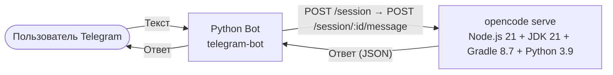

# Architecture

## Components

### Telegram Bot (`bot/`)
- Python 3.11+ with `python-telegram-bot` framework
- Filters messages by `allowed_user_id` from config
- Talks directly to `opencode serve` HTTP API (port 4096)
- Flow:
  1. `POST /session` — creates a new session
  2. `POST /session/:id/message` — sends prompt and waits for response
  3. Extracts text parts from response → returns to user
- Truncates long responses to Telegram's 4096-char limit

### OpenCode Container (`Dockerfile`)
- Base: `ubuntu:22.04`
- Contains: **Node.js 21**, **JDK 21 (Temurin)**, **Gradle 8.7**, **Python 3.9**, **opencode CLI** (npm)
- Runs `opencode serve` (headless HTTP API) on port **4096**
- Default opencode.json with context7 MCP plugin
- Config overridable via volume mount
- `mount/AGENTS.md` injected as global agent instructions
- `mount/SKILLS/` injected as available skills

### Orchestration (`docker-compose.yml`)
- Two services on a shared bridge network
- OpenCode container has:
  - Gradle cache persisted in a Docker volume
  - LLM API keys via environment variables (`ANTHROPIC_API_KEY`, etc.)
- Bot container mounts host config file read-only
- Bot waits for opencode healthcheck before starting

## Data Flow

1. User sends text to Telegram bot
2. Bot validates `allowed_user_id`
3. Bot creates session: `POST http://opencode:4096/session`
4. Bot sends prompt: `POST /session/:id/message` with `parts=[{type:"text", text:"…"}]`
5. opencode processes the prompt (may use tools, MCP, etc.)
6. Response flows back through bot → Telegram
